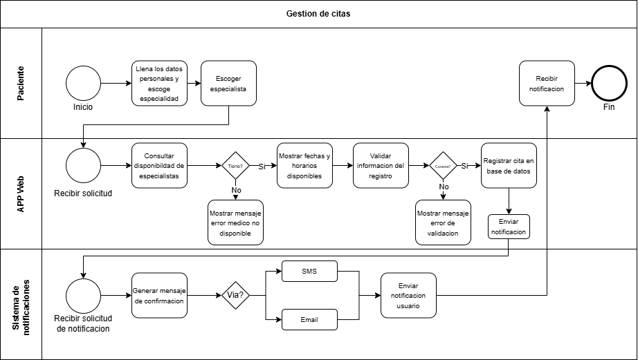

# 🗒️ Registro de Trabajo en Clase - Taller 1

## 📆 Fecha de la sesión
Sabado 7 de febrero del 2026

## 👥 Integrantes presentes
- Jose Guzman
- Bryam Diaz
- Juan Abril

## 🧠 Actividades realizadas en clase

Describa brevemente qué se hizo durante la sesión:

- ¿Qué se discutió con el equipo?

Se realizó la alineación conceptual del proceso de agendamiento de citas médicas de la Clínica Salud Viva, delimitando alcance, actores y flujo de valor. Se identificó el proceso end-to-end desde la solicitud del paciente hasta la confirmación de la cita.

- ¿Qué decisiones de modelado se tomaron?

El equipo acordó estructurar el diagrama BPMN con un evento de inicio asociado a la solicitud de cita y un evento de fin ligado a la confirmación notificada al paciente. Se definieron las actividades principales como selección de especialidad, selección de médico, selección de fecha, validación de disponibilidad, registro de la cita y envío de notificación.

- ¿Qué herramientas se usaron (papel, pizarra, draw.io, Astah)?

En clase llevamos a cabo el taller en draw.io. Esto nos permitió materializar el proceso de agendamiento de citas en un modelo BPMN formal, con una representación visual clara y estandarizada del flujo de negocio.

- ¿Qué parte del trabajo se alcanzó a desarrollar?

Se alcanzó a desarrollar el diagrama BPMN del flujo principal completo del proceso de agendamiento, incluyendo eventos, actividades, decisiones y roles. El modelo ya representa el escenario base operativo y las integraciones esenciales con sistema y notificaciones.

## 🧩 Boceto inicial del modelo

## 🔁 Tareas definidas para complementar el taller

Anote las responsabilidades acordadas entre los miembros del equipo para completar la entrega final:

| Tarea asignada | Responsable | Fecha estimada |
|----------------|-------------|----------------|
| Modelado final en draw.io | Juan Abril | 10/08 |
| Redacción del informe     | Jose Guzman | 11/08 |
| Investigación y referencias | Bryam Diaz | 12/08 |

---

_Este documento resume el trabajo colaborativo realizado durante la sesión del taller 1 en el curso AREM - Universidad de La Sabana._
