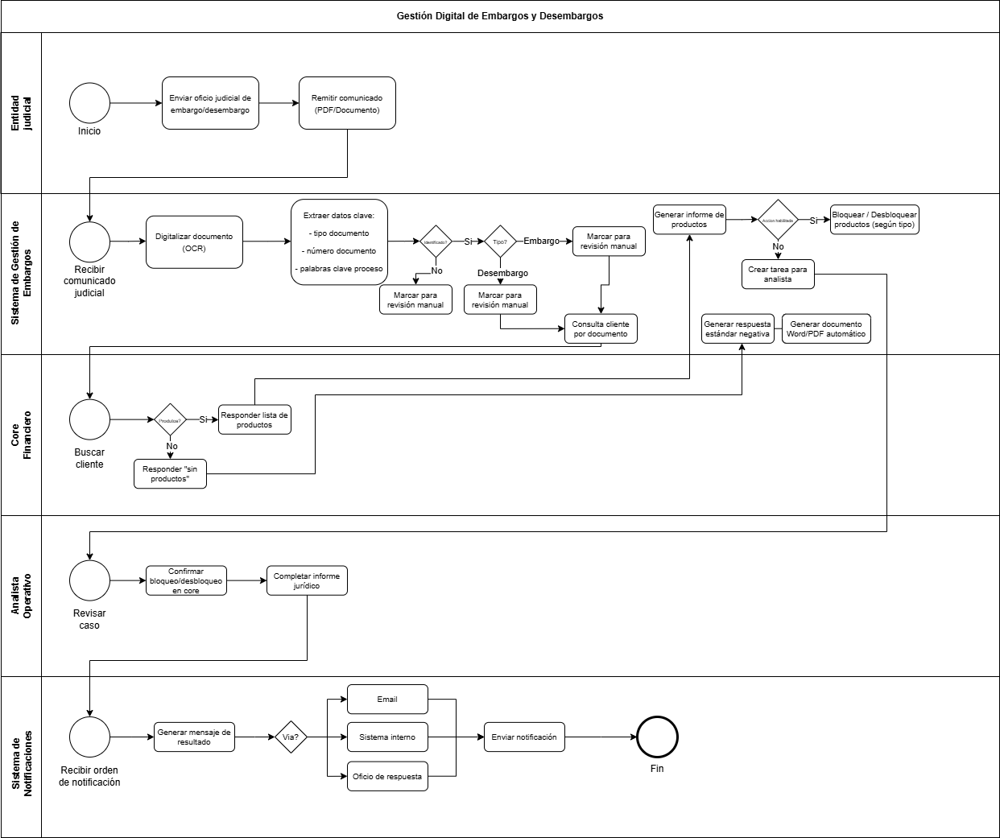

# 📄 Informe Técnico del Taller

## 🔖 Nombre del Taller
Taller 1: Modelado de Proceso del Cliente con BPMN

## 👥 Integrantes del equipo
- Juan Abril (Juan-Abril21)
- Bryam Diaz (BryamDigar)
- Jose Guzman (joseph8884)

## 🧠 Descripción general del trabajo
Implementar una solución que procese automáticamente comunicaciones judiciales (aprox. 400 diarias), identifique si corresponden a embargo o desembargo y ejecute —o prepare— la acción operativa correspondiente sobre los productos financieros del cliente.

## 🔧 Proceso de desarrollo
Se trabajó con enfoque incremental y orientado a valor. Primero se definió el objetivo del cliente: automatizar la gestión de embargos y desembargos y reducir carga operativa. Con eso se delimitó el inicio y fin del proceso y sus resultados esperados.

Después se identificó el flujo principal: recibir oficio, clasificar, consultar productos, ejecutar acción y notificar. Ese fue el “happy path”. Luego se añadieron escenarios alternos como cliente sin productos y revisión manual.

Se decidió modelar en BPMN con swimlanes por actor y sistema. Se usaron compuertas exclusivas para decisiones y eventos de mensaje para integraciones. Las herramientas consideradas para digitalizar fueron Bizagi Modeler, Camunda Modeler y Draw.io con librería BPMN.

## 🧩 Análisis del modelo propuesto
- Cómo se estructura el modelo entregado

El modelo se organiza por carriles de responsabilidad. Se separan actor externo, sistema de gestión, core financiero, analista y notificaciones. Esto mejora gobierno y trazabilidad.

El flujo inicia con evento de mensaje y termina con evento de cierre. Entre ambos hay tareas de procesamiento, validación y decisión. Las compuertas controlan rutas según tipo de oficio y existencia de productos.

- Cómo representa las necesidades del cliente

El diagrama refleja los requerimientos clave: clasificar embargo/desembargo, identificar al cliente y consultar productos. También incluye generación de respuesta automática cuando no hay productos.

Cuando sí existen productos, el modelo contempla bloqueo/desbloqueo o tarea asistida. Además incorpora generación de informe y notificación. Eso cubre el ciclo operativo solicitado.

- Qué supuestos se tomaron

Se asumió disponibilidad de consulta al core por API o servicio interno. También que los oficios llegan en formato digital procesable con OCR.

Se asumió que no todas las decisiones jurídicas se automatizan. Los casos dudosos se desvían a revisión humana. El envío formal al juzgado quedó fuera de alcance.

## 📈 Diagrama final entregado

## 📋 Tabla de actores, entidades o componentes (si aplica)

| Nombre del elemento | Tipo | Descripción | Responsable |
|---------------------|------|-------------|-------------|
| Entidad judicial    | Actor Externo | Envía oficios de embargo/desembargo | Externo |
| Sistema de gestión    | Sistema | Orquesta y registra el proceso | TI |
| Motor OCR    | Componente | Extrae datos del documento | TI |
| Clasificador    | Componente | Determina embargo o desembargo | TI |
| Core financiero    | Sistema | Consulta productos del cliente | TI |
| Analista operativo    | Actor | Revisa excepciones | Operaciones |
| Módulo de bloqueo    | Componente | Bloquea/desbloquea productos | Operaciones |
| Sistema notificaciones   | Sistema | Envía avisos de resultado | TI |

## 🔍 Investigación complementaria
### Tema investigado:
Buenas prácticas BPMN 2.0

### Resumen:
BPMN 2.0 recomienda separar claramente participantes usando pools y lanes. También sugiere usar eventos de mensaje para integraciones y compuertas para decisiones de negocio. El objetivo es que el modelo sea entendible para negocio y TI.

Otra práctica es modelar primero el flujo principal y luego las excepciones. También definir inicio, fin y alcance explícito. Esto reduce ambigüedad y evita sobrecarga visual.

El modelo construido sigue esas pautas. Mantiene responsabilidades claras, decisiones explícitas y puntos de control. Eso lo hace consistente con el enfoque del taller.

## 📚 Referencias
- [1] Object Management Group. Business Process Model and Notation (BPMN) 2.0.2. https://www.omg.org/spec/BPMN/
- [2] Dumas, M. et al. Fundamentals of Business Process Management. Springer, 2018.
- [3] Project Management Institute. PMBOK Guide – 7th Edition. PMI, 2021.
- [3] Fuente oficial BPMN: https://www.omg.org/spec/BPMN/

---

_Este documento hace parte de la entrega del taller 1 del curso AREM (Arquitectura Empresarial) - Universidad de La Sabana._
