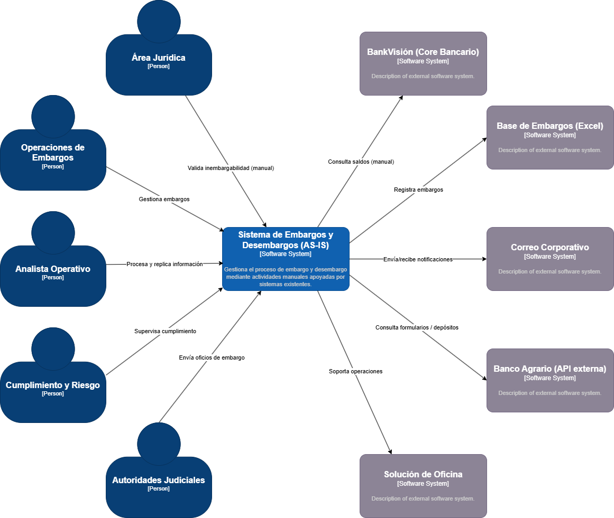
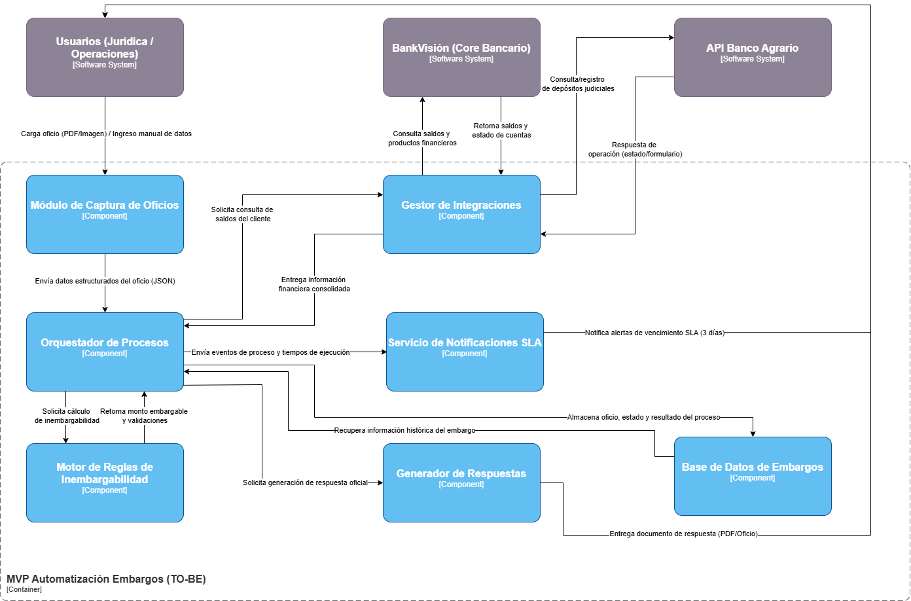
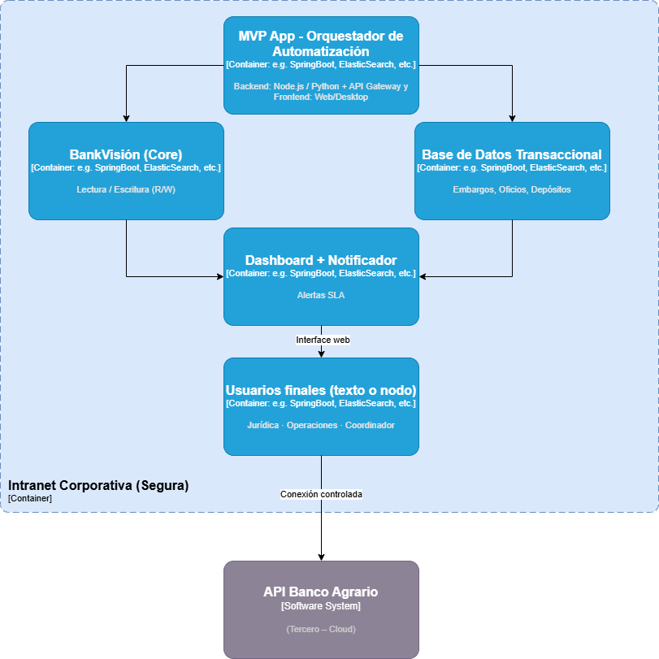

# 🏗️ ENTREGA 4: Mapa de Infraestructura y Diagnóstico Técnico
## Financiera Juriscoop S.A. - Proceso CF-JUR-PRO-002 (Embargo y Desembargo)

---

## 📋 Objetivo

Construir el mapa lógico y físico de la infraestructura tecnológica actual del sistema de Embargo y Desembargo, realizar un diagnóstico de debilidades, cuellos de botella y oportunidades de mejora, y proponer una arquitectura mejorada mediante el MVP de automatización.

---

## 1. Contexto Organizacional

**Organización:** Financiera Juriscoop S.A. (Compañía de Financiamiento)

**Proceso Analizado:** CF-JUR-PRO-002 – Embargo y Desembargo

**Actores Clave Involucrados:**
- Dirección Jurídica y Analista Jurídico
- Dirección de Operaciones y Auxiliar de Operaciones
- Coordinador de Oficina
- Área de Captaciones
- Tesorería
- Sistemas de información: BankVisión (Core Bancario), Solución de Oficina, Banco Agrario (API)

---

## 2. Infraestructura Tecnológica Actual (AS-IS)

### 2.1 Componentes de Infraestructura

| Componente | Descripción | Tipo | Ubicación |
|-----------|-------------|------|-----------|
| **BankVisión (Core)** | Sistema de información principal que gestiona productos y saldos de clientes | On-Premise / Central | Centro de Datos Internos |
| **Solución de Oficina** | Aplicativo utilizado por cajero para transacciones monetarias y cumplimientos físicos | Desktop/Intranet | Sucursales |
| **Base Embargos (Excel)** | Registro manual de embargos en formato spreadsheet | Local / Compartido | Red corporativa |
| **Correo Corporativo** | Sistema de comunicaciones entre Captaciones y otras áreas (novedadescaptaciones@juriscoop.com.co) | En la nube / On-Premise | -  |
| **Banco Agrario (API)** | Sistema externo para depósitos judiciales y consultas de formularios | Tercero / Cloud | Externa |

### 2.2 Flujo de Información Actual (Modelo C4 Contexto)

### 2.3 Topología de Red y Almacenamiento

**Almacenamiento de Datos:**
- **Base Datos Core (BankVisión):** On-Premise, base de datos centralizada con acceso restringido
- **Base Embargos:** Archivo Excel compartido en red corporativa (sin versionamiento ni auditoría)
- **Documentación:** Correos, archivos locales en estaciones de trabajo

**Comunicación:**
- **Intranet Corporativa:** Para acceso a BankVisión y Solución de Oficina
- **Correo Electrónico:** Canal de comunicación entre áreas (sin trazabilidad sistémica)
- **APIs de Terceros:** Integración manual con Banco Agrario mediante formularios web

---

## 3. Diagnóstico de Debilidades, Cuellos de Botella y Riesgos

### 3.1 Debilidades Operativas

| Debilidad | Impacto | Severidad | Area Afectada |
|-----------|--------|----------|--------------|
| **Validación Manual de Saldos** | Repetición de consultas, tiempo de ciclo extendido (hasta 3 días) | 🔴 CRÍTICA | Operaciones |
| **Registro en Excel** | Susceptible a errores humanos, sin auditoría de cambios, falta de integridad de datos | 🔴 CRÍTICA | Datos |
| **Cálculo Manual de Inembargabilidad** | Propenso a errores matemáticos, requiere intervención del abogado en cada caso | 🟡 ALTA | Jurídica |
| **Comunicación por Correo** | No hay trazabilidad sistémica, se pueden perder notificaciones, responsabilidades difusas | 🟡 ALTA | Comunicación |
| **Falta de Alertas Automatizadas** | Riesgo de exceder plazos de 3 días hábiles (SLA regulatorio) | 🔴 CRÍTICA | Cumplimiento |

### 3.2 Cuellos de Botella Identificados

1. **Cuello de Botella #1: Integración Manual BankVisión ↔ Procesos Operativos**
   - Actualización no sistémica de saldos desde el core
   - El Auxiliar de Operaciones debe consultar manualmente BankVisión para cada embargo
   - **Oportunidad de Mejora:** Automatizar la lectura de saldos mediante API o integración directa

2. **Cuello de Botella #2: Falta de Persistencia de Datos Estructurada**
   - La "Base Embargos" es un archivo Excel compartido sin versiones ni auditoría
   - No hay trazabilidad del ciclo de vida del oficio
   - **Oportunidad de Mejora:** Implementar base de datos transaccional dedicada

3. **Cuello de Botella #3: Lógica de Inembargabilidad Descentralizada**
   - El Analista Jurídico calcula límites mentalmente o con calculadora
   - No hay parametrización de reglas SFC
   - **Oportunidad de Mejora:** Crear un motor de reglas configurables

4. **Cuello de Botella #4: Ausencia de Monitoreo de SLA**
   - No hay alertas automáticas para los 3 días hábiles
   - El seguimiento es manual y reactivo
   - **Oportunidad de Mejora:** Implementar dashboard y notificador automático

### 3.3 Riesgos Técnicos

| Riesgo | Probabilidad | Impacto | Mitigación Propuesta |
|--------|-------------|--------|----------------------|
| Pérdida de información en Base Embargos (Excel sin backup) | Media | Crítica | Migrar a BD con copias diarias |
| Multas por incumplimiento de SLA (3 días) | Media | Crítica | Alertas automatizadas |
| Exposición de datos sensibles en correos | Media | Alta | Cifrado y auditoría de correos |
| Punto único de falla en BankVisión | Baja | Crítica | Redundancia de conexiones |

---

## 4. Infraestructura Propuesta (TO-BE MVP)

### 4.1 Arquitectura de Componentes MVP

### 4.2 Componentes de Infraestructura Mejorada

| Componente | Estado Actual | Propuesta MVP | Beneficio |
|-----------|---------------|---------------|-----------|
| **Ingesta de Oficios** | Manual (correo + radicación física) | Modulo de captura digital con OCR básico | Entrada estructurada, sin errores de transcripción |
| **Validación de Saldos** | Manual/Repetitiva | API/Integración BankVisión automatizada | Reducción 80% tiempo de validación |
| **Motor de Inembargabilidad** | Cálculo manual (calculadora) | Motor de reglas parametrizable | Consistencia normativa, 100% exactitud |
| **Registro de Embargos** | Excel compartido | BD transaccional con auditoría | Trazabilidad completa, seguridad de datos |
| **Alertas de Tiempos** | Ninguna (espera pasiva) | Notificador automático + Dashboard | SLA garantizado, visibilidad en tiempo real |
| **Almacenamiento Central** | Distribuido (Excel + correos) | Base de datos centralizada con backup | Integridad, recuperación ante desastres |

### 4.3 Topología de Red Mejorada

---

## 5. Oportunidades de Mejora Identificadas

### Corto Plazo (MVP - 0-3 meses)
✅ **Captura centralizada de oficios** → Módulo input con estructura de datos
✅ **Automatización de cruces de saldos** → Integración BankVisión
✅ **Motor de inembargabilidad parametrizado** → Reglas configurables
✅ **Alertas de tiempos SLA** → Notificador automático

### Mediano Plazo (3-6 meses)
🔄 **Integración con API Banco Agrario** → Automatizar depósitos judiciales
🔄 **Dashboard ejecutivo** → Trazabilidad completa del proceso
🔄 **Auditoría sistémica** → Logs de todas las operaciones

### Largo Plazo (6+ meses)
🚀 **OCR avanzado** → Lectura automática de oficios físicos
🚀 **Machine Learning** → Predicción de inembargabilidades complejas
🚀 **Blockchain** → Inmutabilidad de registros judiciales

---

## 6. Buenas Prácticas de Arquitectura de Infraestructura Aplicadas

### 6.1 Escalabilidad
- **Patrón Microservicios:** Motor de reglas, Notificador y API Gateway como servicios independientes
- **Base de Datos Escalable:** SGBD relacional con índices en campos de búsqueda frecuente (DNI Cliente, Radicado Oficio)

### 6.2 Disponibilidad y Redundancia  
- **Backup Automático:** Copia diaria de base de datos transaccional (diferencial incremental)
- **Recuperación ante Desastres (RTO/RPO):** Max 4 horas de downtime, máximo 1 hora de pérdida de datos
- **Monitoreo Proactivo:** Alertas de espacio disco, CPU, latencia base de datos

### 6.3 Seguridad
- **Cifrado en Tránsito:** TLS 1.2+ para comunicación entre MVP ↔ BankVisión
- **Seguridad en Reposo:** Cifrado de base de datos sensible (datos personales de clientes)
- **Control de Acceso:** RBAC (Role-Based Access Control) para Jurídica, Operaciones, Tesorería
- **Auditoría de Accesos:** Registro de quién, qué y cuándo modificó cada registro

### 6.4 Mantenibilidad
- **Infraestructura como Código (IaC):** Ansible/Terraform para reproducibilidad
- **Versionamiento de Codigo:** Git con ramas dev/staging/prod
- **Documentación Técnica:** Diagramas C4, Modelos ER, Runbooks de operación

### 6.5 Modelo de Despliegue
`**On-Premise Hibrido:**`
- **MVP y BD:** On-Premise (por sensibilidad de datos bancarios)
- **Servicios de Notificación:** Podrian usar cloud (AWS SNS, Azure Service Bus) con conexión VPN
- **Monitoreo Externo:** Cloud (DataDog, New Relic) vía VPN para análisis sin exponer datos

---

## 7. Matriz de Transición AS-IS → TO-BE (MVP)

| Fase | Duración | Hito | Entregables |
|------|----------|------|-------------|
| **Fase 1: Setup** | 2 semanas | Infraestructura lista | Servidores, BD, redes configuradas |
| **Fase 2: MVP v1** | 8 semanas | Ingesta + Motor de Reglas | Captura, automatización de inembargabilidad |
| **Fase 3: Integración** | 4 semanas | Conexión BankVisión | Validación de saldos en tiempo real |
| **Fase 4: Dashboard** | 3 semanas | Monitoreo + Alertas | Visibilidad y SLA garantizado |
| **Pruebas & Go-Live** | 2 semanas | MVP en Producción | Migración de operaciones |

---

## 8. Conclusiones y Recomendaciones

### Principal Hallazgo
La infraestructura actual de Juriscoop prioriza la **robustez del core bancario (BankVisión)** pero adolece de una **capa de integración automatizada y orquestación de procesos.** El proceso de Embargo y Desembargo evoluciona manualmente, incrementando riesgo operativo y exposición a multas regulatorias.

### Recomendaciones Inmediatas
1. ✅ **Aprobar inversión en MVP** para automatizar captura, validación y alertas
2. ✅ **Constituir equipo DevOps** para gestionar infraestructura mejorada
3. ✅ **Implementar ingeniería de datos** para migración ordenada desde Excel → BD
4. ✅ **Capacitar a usuarios finales** en nuevas interfaces (Dashboard, notificadores)

---

## 📚 Referencias

Véase archivo `referencias.md` para fuentes técnicas sobre patrones de infraestructura, escalabilidad y seguridad.