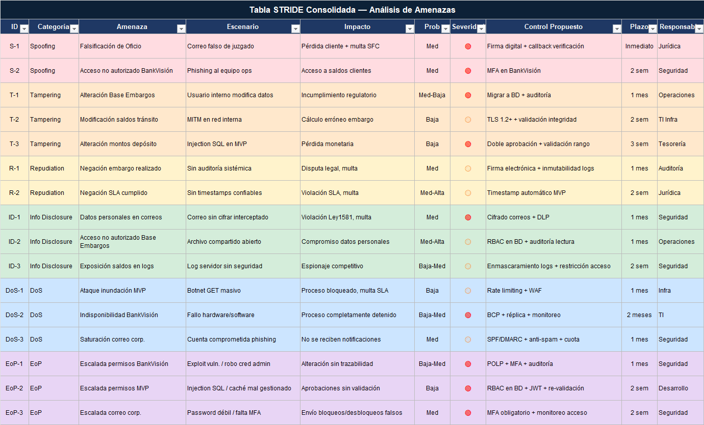

# 🔐 ENTREGA 5: Evaluación de Seguridad con STRIDE
## Financiera Juriscoop S.A. - Proceso CF-JUR-PRO-002 (Embargo y Desembargo)

---

## 📋 Objetivo

Analizar los riesgos de seguridad en el proceso de Embargo y Desembargo de Financiera Juriscoop S.A. utilizando el marco STRIDE (Spoofing, Tampering, Repudiation, Information Disclosure, Denial of Service, Elevation of Privilege). Identificar amenazas, evaluar impactos y proponer controles de mitigación alineados con la sensibilidad de datos financieros y regulatorios.

---

## 1. Contexto de Seguridad

**Criticidad del Sistema:** 🔴 CRÍTICA

**Datos Sensibles Procesados:**
- Información personal de clientes (DNI, nombre, dirección)
- Saldos de productos bancarios
- Montos de embargos y depósitos judiciales
- Comunicaciones legales y decisiones judiciales

**Actores Involucrados:**
- Personas (Autoridades Judiciales, Cumplimiento y Riesgo)
- Sistemas Internos: BankVisión, Solución de Oficina, Base Embargos
- Sistemas Externos: Banco Agrario, Correo Corporativo

**Normativa Aplicable:**
- SFC (Superintendencia Financiera de Colombia) - Circulares respecto a inembargabilidad
- Ley 1581/2012 (Protección de Datos Personales - Colombia)
- Código General del Proceso - Artículos 593/594

---

## 2. Flujo Crítico Analizado: Procesamiento de Oficio de Embargo

```
Autoridad Judicial (Externo)
        │
        ▼ Envía oficio
    Recepción
        │
        ▼ Digitalización + Radicación
    Coordinador de Oficina
        │
        ▼ Almacenamiento (Base Embargos - Excel)
    Auxiliar de Operaciones
        │
        ├─► Consulta BankVisión (Saldos)
        │
        ├─► Analista Jurídico valida inembargabilidad
        │
        └─► Tesorería/Cajero ejecuta depósito
                │
                ▼
            Banco Agrario
```

---

## 3. Análisis STRIDE - Amenazas Identificadas

### 3.1 SPOOFING (Suplantación de Identidad)

#### Amenaza S-1: Falsificación de Oficio Judicial
- **Descripción:** Un actor malintencionado crea un oficio ficticio suplantando a una autoridad judicial para embargar fondos indebidamente
- **Escenario:** Correo falso o documento PDF adulterado llega al Coordinador de Oficina
- **Impacto:** 🔴 CRÍTICO
  - Pérdida financiera del cliente indefenso
  - Daño reputacional a Juriscoop
  - Exposición a demandas legales
  - Multas de la SFC
- **Probabilidad:** Media (existe antecedentes de fraude documentario)
- **Controles Propuestos:**
  - ✅ Verificación de origen del correo: SPF, DKIM, DMARC config en dominio
  - ✅ Validación por callback: Llamada telefónica a autoridad judicial para confirmar radicado
  - ✅ Firma digital electronica en oficios: Certificados reconocidos por MinTIC
  - ✅ Base de datos de autoridades válidas: cross-check con juzgados registrados
- **Responsable:** Dirección Jurídica + TI Seguridad

#### Amenaza S-2: Acceso No Autorizado a BankVisión
- **Descripción:** Actor malintencionado se autentica como Auxiliar de Operaciones usando credenciales robadas
- **Escenario:** Phishing dirigido al equipo operativo
- **Impacto:** 🔴 CRÍTICO - Acceso a saldos de clientes
- **Probabilidad:** Media
- **Controles Propuestos:**
  - ✅ Autenticación Multi-Factor (MFA) en BankVisión
  - ✅ Monitoreo de intentos de login fallido (alert >3)
  - ✅ Auditoría de accesos: logs de quién consultó qué saldos
  - ✅ Capacitación anti-phishing trimestral
- **Responsable:** Dirección de Operaciones + TI Seguridad

---

### 3.2 TAMPERING (Modificación de Datos)

#### Amenaza T-1: Adulteración de Base Embargos (Excel)
- **Descripción:** Un usuario interno modifica el archivo Base Embargos para alterar montos, fechas o estado de embargos
- **Escenario:** Auxiliar de Operaciones baja un embargo para favorecer a un cliente, alterando el registro
- **Impacto:** 🔴 CRÍTICO
  - Incumplimiento regulatorio (SFC)
  - Pérdida de integridad de auditoría
  - Demanda del acreedor o autoridad judicial
  - Multa SFC potencial
- **Probabilidad:** Media-Baja (requiere acceso físico a máquina + archivo compartido)
- **Controles Propuestos:**
  - ✅ Migrar a BD transaccional con auditoría de cambios (quién, cuándo, qué)
  - ✅ Controles de concurrencia: prevenir ediciones simultáneas
  - ✅ Backups diarios con hash verificable
  - ✅ Permisos de lectura para auditoría, y escritura restringida a operaciones
- **Responsable:** Dirección de Operaciones + TI

#### Amenaza T-2: Modificación de Saldos en Tránsito (BankVisión → MVP)
- **Descripción:** El dato de saldo consultado es interceptado y modificado antes de llegar al motor de inembargabilidad
- **Escenario:** Man-in-the-Middle en conexión interna (red corporativa comprometida)
- **Impacto:** 🟡 ALTA - Cálculo erróneo de embargo
- **Probabilidad:** Baja (requiere acceso a red interna)
- **Controles Propuestos:**
  - ✅ Cifrado TLS 1.2+ en conexión API (BankVisión ↔ MVP)
  - ✅ Validación de certificados servidor
  - ✅ Verificación de integridad: hash del payload
- **Responsable:** TI Infraestructura + Seguridad

#### Amenaza T-3: Alteración de Montos en Depósito Judicial
- **Descripción:** El monto a depositar en Banco Agrario es alterado antes de ejecutar la transacción
- **Escenario:** Injection SQL o modificación en memoria del MVP
- **Impacto:** 🔴 CRÍTICO - Pérdida monetaria
- **Probabilidad:** Baja (requiere exploit de vulnerabilidad)
- **Controles Propuestos:**
  - ✅ Validación del monto: rango permitido según oficio (min-max)
  - ✅ Doble aprobación: Tesorero y Jurídica confirman montos antes de depósito
  - ✅ Auditoría de transacción: log inmutable
- **Responsable:** Dirección de Operaciones + Tesorería

---

### 3.3 REPUDIATION (Repudio / Negación de Acción)

#### Amenaza R-1: Negación de Embargo Realizado
- **Descripción:** Juriscoop niega haber procesado un embargo cuando sí lo hizo, causando disputa legal
- **Escenario:** No hay evidencia digital de quién aprobó y cuándo
- **Impacto:** 🟡 ALTA - Disputa legal, multa SFC
- **Probabilidad:** Media (estado actual sin auditoría sistémica)
- **Controles Propuestos:**
  - ✅ Firma electrónica de aprobación por Analista Jurídico
  - ✅ Timestamps sincronizados (NTP) en todos los eventos
  - ✅ Inmutabilidad de logs: almacenamiento en base de datos con permisos append-only
  - ✅ Cadena de custodia documentada: quién recibe, quién procesa, quién aprueba
- **Responsable:** Dirección Jurídica + Auditoría Interna

#### Amenaza R-2: Negación de Tiempos de Respuesta Cumplidos
- **Descripción:** Juriscoop dice haber respondido en 3 días cuando realmente se demoraron más
- **Escenario:** Falta de timestamps confiables en correos de respuesta
- **Impacto:** 🟡 ALTA - Violación SLA, multa
- **Probabilidad:** Media-Alta (común en procesos manuales)
- **Controles Propuestos:**
  - ✅ Timestamp de envío automático en MVP
  - ✅ Notificador SLA: registro independiente de tiempos
  - ✅ Auditoría de correo: integración con servidor de email corporativo
- **Responsable:** Dirección Jurídica + TI

---

### 3.4 INFORMATION DISCLOSURE (Divulgación de Información)

#### Amenaza ID-1: Exposición de Datos Personales en Correos
- **Descripción:** Información sensible de clientes (DNI, saldos) se transmite por correo sin cifrar
- **Escenario:** Correo corporativo interceptado, o correo reenviado a terceros inadecuados
- **Impacto:** 🔴 CRÍTICO - Violación Ley 1581, daño reputacional, multa
- **Probabilidad:** Media (correos son medio habitual)
- **Controles Propuestos:**
  - ✅ Cifrado de correos por defecto (S/MIME o PGP)
  - ✅ Restricción de envío: solo a dominios @juriscoop.com.co
  - ✅ Política de No retransmitir datos sensibles por correo
  - ✅ DLP (Data Loss Prevention): scan de correos con DNI/números cuenta
- **Responsable:** Dirección de Seguridad + TI

#### Amenaza ID-2: Acceso No Autorizado a Base Embargos (Excel)
- **Descripción:** Personal de otras áreas accede al archivo Excel sin necesidad operativa
- **Escenario:** Archivo compartido en carpeta abierta, o acceso por contraseña débil
- **Impacto:** 🟡 ALTA - Compromiso de datos personales
- **Probabilidad:** Media-Alta (Excel es fácil de compartir)
- **Controles Propuestos:**
  - ✅ MigraR a BD con control de acceso granular (RBAC)
  - ✅ Auditoría de lectura: quién consultó qué datos y cuándo
  - ✅ Enmascaramiento de datos: ocultar últimos dígitos de DNI en reportes
- **Responsable:** Dirección de Operaciones + TI

#### Amenaza ID-3: Exposición de Saldos en Trazas de Sistema
- **Descripción:** Saldos quedan registrados en logs de aplicación sin cifrar
- **Escenario:** Log del MVP queda accesible en servidor sin seguridad
- **Impacto:** 🟡 ALTA - Espionaje competitivo, violación privacy
- **Probabilidad:** Baja-Media (requiere acceso a infraestructura)
- **Controles Propuestos:**
  - ✅ Enmascaramiento en logs: reemplazar saldos por "XXXXX"
  - ✅ Restricción de acceso a logs: solo administradores TI certificados
  - ✅ Rotación de logs: conservar 90 días en almacenamiento seguro
- **Responsable:** TI Infraestructura + Seguridad

---

### 3.5 DENIAL OF SERVICE (Negación de Servicio)

#### Amenaza DoS-1: Ataque de Inundación al MVP
- **Descripción:** Actor externo envía solicitudes masivas al sistema MVP para saturar recursos
- **Escenario:** Botnet lanza GET requests al MVP API
- **Impacto:** 🟡 ALTA - Proceso de embargo detenido, no se responden en 3 días, multa SLA
- **Probabilidad:** Baja (MVP está on-premise, no internet público)
- **Controles Propuestos:**
  - ✅ Rate limiting: máx 100 req/min por IP
  - ✅ WAF (Web Application Firewall): reglas de detección de patrones
  - ✅ Auto-scaling: aumentar recursos si latencia > umbral
  - ✅ Alerta operativa: notificar TI si no responde en 5 min
- **Responsable:** TI Infraestructura

#### Amenaza DoS-2: Indisponibilidad de BankVisión
- **Descripción:** Base de datos o aplicación BankVisión se cae, bloqueando consulta de saldos
- **Escenario:** Fallo hardware, actualización sin planeación, falta de mantenimiento preventivo
- **Impacto:** 🔴 CRÍTICO - Proceso embargos completamente detenido
- **Probabilidad:** Baja-Media (sistema crítico pero sin redundancia clara)
- **Controles Propuestos:**
  - ✅ Plan de continuidad del negocio (BCP): BankVisión en standby/réplica
  - ✅ RTO < 1 hora, RPO < 15 min
  - ✅ Mantenimiento preventivo: ventana semanal programada
  - ✅ Monitoreo de performance: alertas si CPU >80%, disco >90%
- **Responsable:** Dirección de TI + Operaciones

####  Amenaza DoS-3: Saturación de Correo Corporativo
- **Descripción:** Spam o envío masivo de correos desde cuenta de Juriscoop bloquea Captaciones
- **Escenario:** Cuenta comprometida usada para phishing masivo
- **Impacto:** 🟡 ALTA - No se reciben notificaciones de bloqueo/desbloqueo
- **Probabilidad:** Media
- **Controles Propuestos:**
  - ✅ SPF/DMARC/DKIM: evitar suplantación de dominio
  - ✅ Anti-spam: filtro de correos maliciosos
  - ✅ Cuota por usuario: límite diario de correos enviados
  - ✅ Alerta: si >50 correos en 1 minuto, bloquear cuenta
- **Responsable:** TI Seguridad

---

### 3.6 ELEVATION OF PRIVILEGE (Escalada de Privilegios)

#### Amenaza EoP-1: Escalada de Permisos en BankVisión
- **Descripción:** Usuario operativo obtiene acceso de administrador y modifica saldos directamente
- **Escenario:** Explotación de vulnerabilidad en BankVisión o robo de credencial admin
- **Impacto:** 🔴 CRÍTICO - Alteración sin trazabilidad
- **Probabilidad:** Baja-Media
- **Controles Propuestos:**
  - ✅ Principio de Privilegios Mínimos (PoLP): cada rol solo tiene permisos necesarios
  - ✅ Separación de funciones: quien consulta NO puede modificar
  - ✅ MFA para cualquier operación de cambio de saldos
  - ✅ Auditoría: log inmediato si admin modifica saldos
- **Responsable:** TI Seguridad + Dirección de Operaciones

#### Amenaza EoP-2: Escalada de Privilegios en MVP
- **Descripción:** Usuario normal (Auxiliar Operaciones) obtiene permisos de Jurídico para aprobar embargos
- **Escenario:** Inyección SQL en parámetro de sesión, o caché de permisos mal gestionado
- **Impacto:** 🔴 CRÍTICO - Aprobaciones sin validación legal
- **Probabilidad:** Baja (requiere exploit específico)
- **Controles Propuestos:**
  - ✅ RBAC en BD: roles definitivos en cada request API
  - ✅ Token JWT con expiración: sesión máximo 8 horas
  - ✅ Re-validación periódica: confirmar permisos del usuario cada operación crítica
  - ✅ Logs de cambio de permisos: auditoría de elevaciones
- **Responsable:** Desarrollo MVP + TI Seguridad

#### Amenaza EoP-3: Escalada en Correo Corporativo
- **Descripción:** Usuario obtiene acceso a cuenta de Jurídica o Captaciones
- **Escenario:** Password débil, falta de MFA, credential stuffing
- **Impacto:** 🔴 CRÍTICO - Puede enviar bloqueos/desbloqueos falsos
- **Probabilidad:** Media
- **Controles Propuestos:**
  - ✅ MFA obligatorio en todas las cuentas corporativas
  - ✅ Política de password: mínimo 12 caracteres, cambio trimestral
  - ✅ Monitoreo de acceso: alerta si login desde IP no habitual
  - ✅ Revocar acceso: cuando empleado se retira en <1 hora
- **Responsable:** TI Seguridad + RRHH

---

## 4. Tabla STRIDE Consolidada

---

## 5. Matriz de Riesgos: STRIDE

```
                          IMPACTO
                  Bajo    Med      Alto    Crítico
PROBABILIDAD ┌─────────────────────────────────┐
   Baja      │  T-2    DoS-1    ID-3   DoS-2  │
             │        
   Media-Baja│  T-1                           │
             │
   Media     │ S-1 S-2 │ ID-2    R-1   T-3    │ ◄── Zona de Atención
             │         │ DoS-3   R-2   EoP-1  │     (Action Required)
   Media-Alta│         │        ID-1   EoP-3  │
             │
   Alta      │         │        EoP-2          │ ◄── Zona Crítica
             │         │                        │     (Urgent)
             └─────────────────────────────────┘

🔴 Crítica (Impacto Alto/Crítico) = 11 amenazas
🟡 Alta (Impacto Medio-Alto)       = 6 amenazas
```

---

## 6. Plan de Mitigación Priorizado

### **FASE 1: INMEDIATA (Semana 1-2)**
Reducir riesgo crítico de falsificación y acceso no autorizado
- [ ] **S-1:** Implementar verificación callback para oficios
- [ ] **S-2:** Activar MFA en BankVisión
- [ ] **EoP-2:** Validar RBAC en MVP antes de go-live
- [ ] **ID-1:** Cifrado de correos corporativos

### **FASE 2: URGENTE (Mes 1)**
Abordar integridad de datos y auditoría
- [ ] **T-1:** Migrar Base Embargos a BD transaccional
- [ ] **R-1:** Implementar firma electrónica y logs inmutables
- [ ] **ID-2:** Controles de acceso granular en BD
- [ ] **DoS-3:** Implementar DLP y anti-spam

### **FASE 3: IMPORTANTE (Mes 2-3)**
Mejorar disponibilidad y escalabilidad
- [ ] **DoS-2:** Plan de continuidad BankVisión con réplica
- [ ] **EoP-1:** Segregación de funciones y auditoría de cambios
- [ ] **DoS-1:** Rate limiting y WAF en MVP
- [ ] **T-3:** Doble aprobación en transacciones críticas

### **FASE 4: MANTENIMIENTO (Continuo)**
- Auditorías de seguridad trimestrales
- Pen testing anual del MVP
- Capacitación anti-phishing semestral
- Actualización de políticas normativas (SFC)

---

## 7. Investigación: Buenas Prácticas de Seguridad en Sector Financiero

### 7.1 Marcos Aplicables
- **ISO/IEC 27001:** Gestión de seguridad de información
- **NIST Cybersecurity Framework:** Risk management integral
- **SFC Circulares:** Normativa específica para financieras en Colombia
- **PCI-DSS:** Si procesa tarjetas (no aplica en este caso)

### 7.2 Principios de Seguridad por Capas (Defense in Depth)
1. **Perímetro:** Firewall, VPN, WAF
2. **Acceso:** Autenticación MFA, RBAC
3. **Datos:** Cifrado en tránsito y reposo
4. **Aplicación:** Coding seguro, validación input, logs
5. **Monitoreo:** SIEM, audit trail, alertas

### 7.3 Accionables para Juriscoop
✅ Adoptar **Zero Trust Model:** verificar cada acceso, no confiar por defecto
✅ Implementar **Logging and Monitoring:** SIEM para análisis centralizado
✅ Programa de **Security Awareness:** entrenamientos a empleados
✅ **Incident Response Plan:** procedimiento ante brechas detectadas

---

## 8. Conclusiones y Recomendaciones

### Hallazgo Crítico
El proceso actual de Embargo y Desembargo tiene **exposición severa en 3 áreas:**
1. 🔴 **Autenticación débil** de oficios judiciales (riesgo falsificación)
2. 🔴 **Integridad de datos** vulnerable en Excel sin auditoría
3. 🔴 **Falta de trazabilidad** para repudio y compliance

### Recomendación Principal
**Implementar el MVP con controles STRIDE integrados** desde el diseño, no como agregado posterior. Esto incluye:
- Captura segura de oficios (firma digital, callback)
- BD transaccional con auditoría inmutable
- Autenticación MFA para operaciones críticas
- Cifrado de datos sensibles en tránsito y reposo
- Monitoreo continuo y alertas

### Rol de Cumplimiento
**SFC espera que Juriscoop demuestre:**
- Control sobre acceso a datos de clientes
- Auditoría forense de quién modificó qué
- Respuesta a SLA de 3 días sin fallo
- Protección contra suplantación y fraude

---

## 📚 Referencias

Véase archivo `referencias.md` para fuentes sobre STRIDE, ISO 27001, normativa SFC y casos de estudio en sector financiero.
