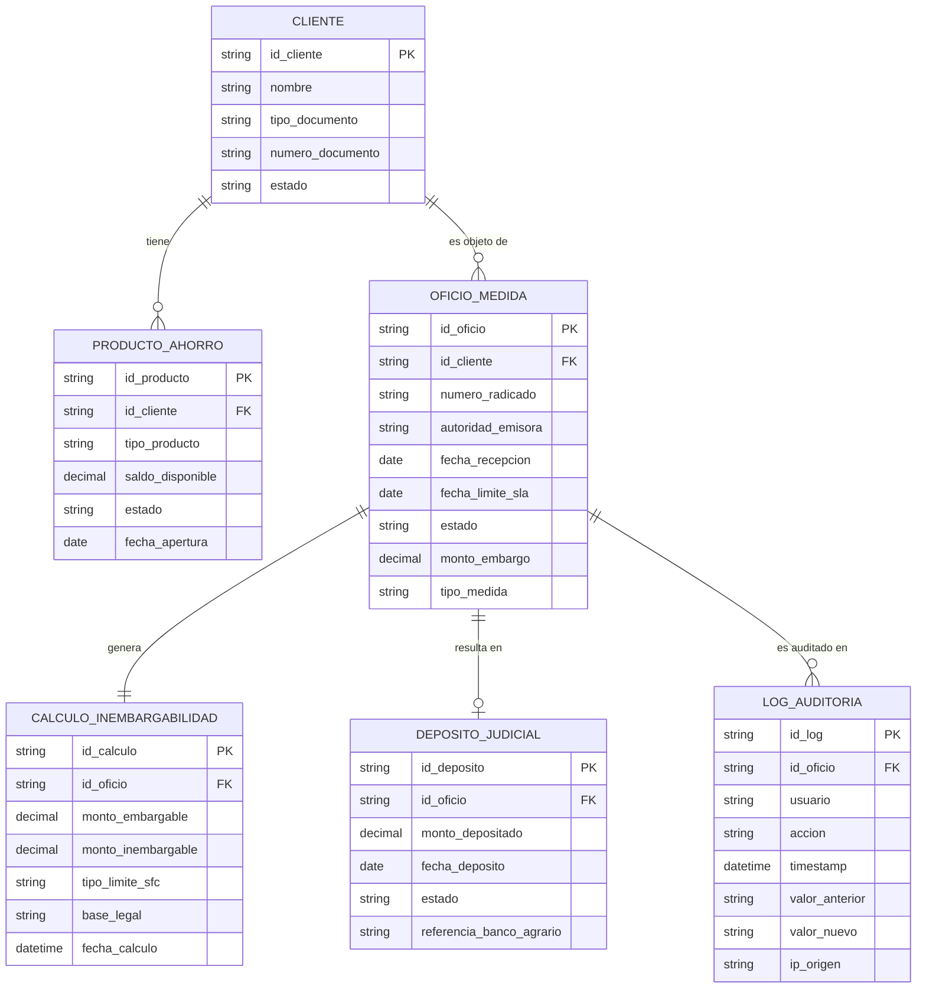
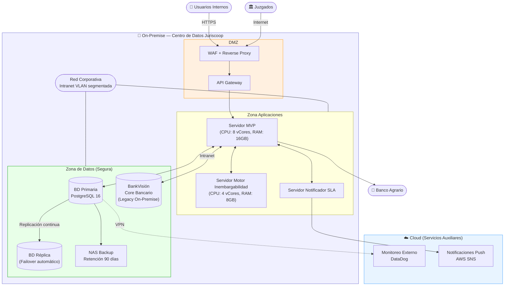
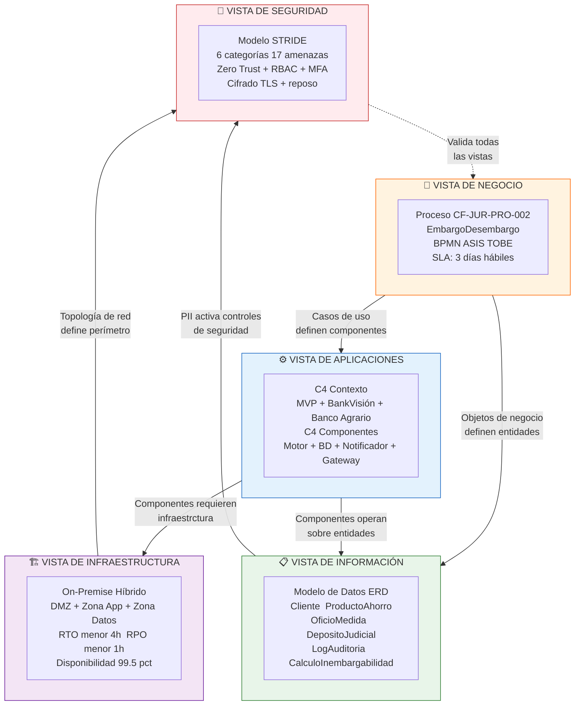

# 🏛️ ENTREGA 7: Integración de Vistas de Arquitectura
## Financiera Juriscoop S.A. — Proceso CF-JUR-PRO-002 (Embargo y Desembargo)

---

> **Equipo:** Jose Guzman · Juan Abril · Bryam Diaz
> **Curso:** Arquitectura Empresarial — Universidad de La Sabana
> **Fecha:** Mayo 2026

---

## 📋 Objetivo

Integrar todas las vistas arquitectónicas desarrolladas a lo largo del proyecto en una narrativa visual coherente, identificando cómo se relacionan entre sí y cómo soportan colectivamente los objetivos estratégicos de Financiera Juriscoop S.A. en el contexto del proceso CF-JUR-PRO-002 (Embargo y Desembargo).

La integración abarca cinco dominios de vista: **Negocio**, **Información**, **Aplicaciones**, **Infraestructura** y **Seguridad**, analizando las relaciones entre capas y documentando las decisiones arquitectónicas que les dan coherencia sistémica.

---

## 🧪 PARTE 1: Vistas Arquitectónicas del Proyecto

---

### 1.1 Vista de Negocio (BPMN) — Proceso AS-IS (Estado Actual)

La vista de negocio describe el flujo operacional del proceso CF-JUR-PRO-002 tal como opera actualmente en Financiera Juriscoop S.A. Este proceso involucra cinco áreas organizacionales coordinadas principalmente a través de correo electrónico y consultas manuales en BankVisión, con un registro central en un archivo Excel denominado "Base Embargos".

**Actores del proceso:**
- **Autoridad Judicial:** Entidad externa que emite el oficio de embargo
- **Coordinador de Oficina:** Recibe, digitaliza y radica el oficio
- **Auxiliar de Operaciones:** Consulta BankVisión y registra en Base Embargos
- **Analista Jurídico:** Valida inembargabilidad y aprueba la respuesta
- **Área de Captaciones:** Notificada del bloqueo/desbloqueo
- **Tesorería / Cajero:** Ejecuta el depósito judicial
- **Banco Agrario:** Sistema externo receptor del depósito judicial

**Características críticas del AS-IS:**
- Tiempo de ciclo: hasta 3 días hábiles (SLA regulatorio máximo)
- Registro centralizado en Excel sin auditoría
- Cálculo de inembargabilidad manual por el Analista Jurídico
- Comunicación inter-áreas por correo corporativo sin trazabilidad sistémica
- Integración con Banco Agrario mediante formularios web manuales

---

### 1.2 Vista de Negocio (BPMN) — Proceso TO-BE (MVP Propuesto)

La arquitectura TO-BE propone un modelo de orquestación sistémica donde el MVP centraliza la gestión del ciclo de vida de cada oficio, automatizando las tareas repetitivas y manteniendo al Analista Jurídico como punto de aprobación human-in-the-loop para las decisiones de mayor criticidad legal.

**Cambios estructurales clave:**
- **Captura digitalizada:** Módulo de ingesta estructurada reemplaza la recepción por correo
- **Integración BankVisión:** Middleware/RPA consulta saldos automáticamente sin intervención manual
- **Motor de Inembargabilidad:** Algoritmo parametrizado con reglas SFC calcula montos con precisión del 100%
- **Notificador SLA:** Alertas escalonadas a 72h, 48h y 24h antes del vencimiento
- **Base de Datos Transaccional:** Sustituye el Excel con auditoría completa e integridad referencial
- **Dashboard Operacional:** Visibilidad en tiempo real del estado de todos los casos activos

---

### 1.3 Vista de Información — Modelo de Datos (ERD)

La vista de información define las entidades de datos fundamentales del proceso, sus atributos y las relaciones semánticas que las vinculan. Este modelo sustenta tanto el diseño del MVP como las decisiones de gobierno de datos propuestas.

**Entidades principales:**

| Entidad | Descripción | Atributos Clave |
|---------|-------------|-----------------|
| **Cliente** | Persona natural o jurídica sujeta a medida de embargo | id_cliente, nombre, tipo_doc, num_doc, estado |
| **ProductoAhorro** | Cuenta o producto financiero del cliente en Juriscoop | id_producto, id_cliente, tipo_producto, saldo, estado |
| **OficioMedida** | Orden judicial de embargo recibida | id_oficio, radicado, autoridad, fecha_recepcion, estado, monto_embargo |
| **CalculoInembargabilidad** | Resultado del motor de reglas SFC | id_calculo, id_oficio, monto_embargable, monto_inembargable, tipo_limite |
| **DepositoJudicial** | Transacción de depósito al Banco Agrario | id_deposito, id_oficio, monto, fecha_deposito, estado |
| **LogAuditoria** | Registro inmutable de cada evento del ciclo del oficio | id_log, id_oficio, usuario, accion, timestamp, valor_anterior, valor_nuevo |

**Relaciones críticas:**
- Un **Cliente** puede tener múltiples **ProductosAhorro** y múltiples **OficiosMedida**
- Cada **OficioMedida** genera exactamente un **CalculoInembargabilidad** y puede generar un **DepositoJudicial**
- Todos los cambios de estado de un **OficioMedida** quedan registrados en **LogAuditoria**

---

### 1.4 Vista de Aplicaciones — C4 Nivel 1: Contexto

La vista de aplicaciones en el nivel de contexto (C4 Level 1) posiciona el sistema MVP dentro de su ecosistema de actores externos y sistemas relacionados, definiendo los límites del sistema y sus interfaces principales.

**Sistema central:** MVP de Gestión de Embargos y Desembargos

**Actores externos:**
- **Autoridades Judiciales:** Emiten oficios de embargo que ingresan al sistema
- **Analista Jurídico:** Usuario interno que aprueba la respuesta a cada oficio
- **Auxiliar de Operaciones:** Usuario interno que supervisa el procesamiento
- **Coordinador de Oficina:** Usuario interno responsable de la recepción inicial

**Sistemas relacionados:**
- **BankVisión (Core Bancario):** Sistema on-premise que provee saldos y estado de productos
- **Banco Agrario:** Sistema externo receptor de los depósitos judiciales
- **Correo Corporativo:** Canal de comunicación (a reemplazar progresivamente)

---

### 1.5 Vista de Aplicaciones — C4 Nivel 3: Componentes del MVP

En el nivel de componentes (C4 Level 3), se descompone el sistema MVP en sus módulos internos, describiendo las responsabilidades de cada uno y sus dependencias.

**Componentes del MVP:**

| Componente | Responsabilidad | Tecnología Propuesta |
|-----------|-----------------|---------------------|
| **Módulo de Captura** | Ingesta y estructuración de oficios judiciales entrantes | Formulario web + OCR básico |
| **Motor de Inembargabilidad** | Aplicación algorítmica de reglas SFC para calcular montos | Servicio REST con reglas parametrizables |
| **Middleware BankVisión** | Integración con core bancario para consulta automatizada de saldos | RPA / API Adapter |
| **Base de Datos Transaccional** | Repositorio central con auditoría, integridad referencial y logs inmutables | SGBD relacional (PostgreSQL) |
| **Notificador SLA** | Sistema de alertas escalonadas por vencimiento de plazo legal | Servicio de colas + email/SMS |
| **Dashboard Operacional** | Panel de control con KPIs en tiempo real | Frontend web con gráficas |
| **API Gateway** | Punto de entrada unificado con autenticación y control de acceso | Kong / Nginx |

---

### 1.6 Vista de Infraestructura — Topología de Red

La vista de infraestructura describe la topología física y lógica sobre la que se despliega el MVP, incluyendo servidores, redes, zonas de seguridad y conexiones con sistemas externos.

**Modelo de despliegue: On-Premise Híbrido**

Dado el carácter confidencial de los datos bancarios y las restricciones regulatorias de la SFC sobre la soberanía de datos financieros, el MVP se despliega principalmente on-premise, con servicios auxiliares en la nube.

**Zonas de red:**

| Zona | Componentes | Justificación |
|------|-------------|---------------|
| **DMZ (Zona Desmilitarizada)** | API Gateway, WAF, Reverse Proxy | Primera línea de defensa ante accesos externos |
| **Zona Aplicaciones (Intranet)** | MVP, Motor de Inembargabilidad, Notificador SLA | Lógica de negocio protegida |
| **Zona de Datos (Intranet segura)** | BD Transaccional, BankVisión Core, Backup | Máxima protección de datos sensibles |
| **Zona Cloud (Servicios auxiliares)** | Monitoreo externo (DataDog/New Relic), Notificaciones push | Servicios sin acceso a datos sensibles |

**Parámetros de disponibilidad:**
- RTO (Recovery Time Objective): < 4 horas
- RPO (Recovery Point Objective): < 1 hora
- Disponibilidad objetivo: 99.5%
- Backups: Automáticos diarios con verificación de integridad (hash)

---

### 1.7 Vista de Seguridad — Mapa de Amenazas STRIDE

La vista de seguridad, fundamentada en el modelo STRIDE (Spoofing, Tampering, Repudiation, Information Disclosure, Denial of Service, Elevation of Privilege), identifica las amenazas relevantes para cada componente del sistema y los controles de mitigación asociados.

**Clasificación de seguridad del sistema:** 🔴 CRÍTICA

Fundamentada en: tratamiento masivo de PII financiera y judicial, naturaleza regulatoria del proceso con implicaciones legales directas, e integración con el core bancario de la entidad.

**Resumen de amenazas por categoría:**

| Categoría STRIDE | Amenaza Principal | Control Primario |
|-----------------|------------------|-----------------|
| **S — Spoofing** | Falsificación de oficio judicial por correo | SPF/DKIM/DMARC + callback a juzgados + MFA |
| **T — Tampering** | Adulteración del registro Excel / Base de datos | Logs inmutables append-only + TLS 1.2+ |
| **R — Repudiation** | Negación de acciones ante la SFC o juzgados | Timestamping certificado + expediente digital inmutable |
| **I — Information Disclosure** | Exposición de PII en correos y Excel | Cifrado en tránsito (TLS) y en reposo + RBAC |
| **D — Denial of Service** | Indisponibilidad de BankVisión o saturación operacional | Modo degradado + rate limiting + WAF |
| **E — Elevation of Privilege** | Acceso de operativo a funciones de aprobación jurídica | Zero Trust + RBAC estricto + segregación de funciones |

```mermaid
flowchart LR
    subgraph SPOOFING["S — Spoofing"]
        direction TB
        S1["S-1: Falsificación\nde Oficio Judicial"]
        S2["S-2: Acceso con\ncredenciales robadas"]
        S_CTR["✅ SPF/DKIM/DMARC\n✅ MFA Universal\n✅ Callback a juzgados"]
    end

    subgraph TAMPERING["T — Tampering"]
        direction TB
        T1["T-1: Adulteración\nBase Embargos"]
        T2["T-2: MitM en\ntránsito de datos"]
        T_CTR["✅ BD Transaccional\n✅ Logs inmutables\n✅ TLS 1.2+"]
    end

    subgraph REPUDIATION["R — Repudiation"]
        direction TB
        R1["R-1: Negación de\nembargo realizado"]
        R2["R-2: Negación de\nSLA cumplido"]
        R_CTR["✅ Timestamping\ncertificado\n✅ Expediente digital\ninmutable"]
    end

    subgraph INFO["I — Info Disclosure"]
        direction TB
        I1["I-1: Exposición\nde PII en correos"]
        I2["I-2: Acceso a\ndatos sin autorización"]
        I_CTR["✅ Cifrado en reposo\n✅ RBAC granular\n✅ Enmascaramiento en logs"]
    end

    subgraph DOS["D — Denial of Service"]
        direction TB
        D1["D-1: Ataque\nde inundación"]
        D2["D-2: Indisponibilidad\nde BankVisión"]
        D_CTR["✅ WAF + Rate Limiting\n✅ Modo degradado\n✅ Monitoreo activo"]
    end

    subgraph EOP["E — Elevation of Privilege"]
        direction TB
        E1["E-1: Escalada en\nBankVisión"]
        E2["E-2: Operativo\naprueba sin jurídico"]
        E_CTR["✅ Zero Trust\n✅ Segregación\nde funciones\n✅ PoLP"]
    end

    SPOOFING --> TAMPERING
    TAMPERING --> REPUDIATION
    REPUDIATION --> INFO
    INFO --> DOS
    DOS --> EOP

    style SPOOFING fill:#ffe0e0,stroke:#cc0000
    style TAMPERING fill:#fff0e0,stroke:#ff8800
    style REPUDIATION fill:#fffde0,stroke:#ccaa00
    style INFO fill:#e0f0ff,stroke:#0066cc
    style DOS fill:#ffe0f0,stroke:#cc0066
    style EOP fill:#f0e0ff,stroke:#6600cc
```

---

## 🧠 PARTE 2: Integración de Vistas — Aplicación al Cliente Real (Juriscoop)

---

### 2.1 Tablero de Vistas Integradas

Las cinco vistas arquitectónicas descritas en la Parte 1 no son documentos independientes: constituyen perspectivas complementarias de una misma arquitectura, cada una iluminando un aspecto diferente del sistema y respondiendo a las necesidades de distintos grupos de interés. La integración de estas vistas revela la coherencia sistémica del diseño y permite identificar las dependencias transversales que no son visibles desde ninguna vista individual.

La lectura integrada de las vistas permite identificar tres patrones estructurales que atraviesan toda la arquitectura:

**Patrón 1: El proceso de negocio como conductor de todos los demás dominios.** Cada elemento de las vistas de Información, Aplicaciones, Infraestructura y Seguridad existe para soportar un paso específico del proceso BPMN. El Motor de Inembargabilidad (Vista Aplicaciones) existe porque el proceso de negocio requiere calcular el monto embargable. La entidad `CalculoInembargabilidad` en el ERD (Vista Información) captura el resultado de ese cálculo. El servidor de aplicaciones en la intranet (Vista Infraestructura) aloja ese motor. Y el control de acceso RBAC (Vista Seguridad) garantiza que solo el Analista Jurídico pueda aprobar ese cálculo.

**Patrón 2: La trazabilidad como hilo conductor entre datos, aplicaciones y seguridad.** El requisito de trazabilidad completa del ciclo de vida de cada oficio (identificado como riesgo crítico R-06 en el análisis de riesgos) se materializa en tres vistas simultáneamente: la entidad `LogAuditoria` en el ERD, el componente de Logs Inmutables en la Vista de Aplicaciones, y los controles de Repudiation (R) en la Vista de Seguridad. Esta correspondencia no es coincidencia: es el resultado de diseñar las vistas de manera coherente desde el mismo requisito de negocio.

**Patrón 3: La regulación SFC como requisito transversal que condiciona todas las vistas.** Las circulares de la SFC, el CGP Art. 593/594 y la Ley 1581/2012 imponen restricciones que se reflejan en cada vista: el SLA de 3 días define la urgencia del proceso de negocio; los montos de inembargabilidad definen el modelo de datos del cálculo; el Motor de Reglas es el componente de aplicación que implementa esos umbrales; la infraestructura on-premise responde a la soberanía de datos financieros; y los controles STRIDE responden a las obligaciones de seguridad de la información del sector financiero.

---

### 2.2 Cómo se Conectan las Capas: Relaciones Entre Vistas

#### Negocio → Aplicaciones
El flujo BPMN del proceso define los casos de uso del MVP. Cada actividad del proceso tiene un componente correspondiente en la Vista de Aplicaciones: la "Recepción del Oficio" corresponde al Módulo de Captura; la "Consulta de Saldos en BankVisión" corresponde al Middleware de Integración; la "Validación de Inembargabilidad" corresponde al Motor de Reglas; el "Seguimiento de 3 días" corresponde al Notificador SLA. No existe ningún componente del MVP que no responda a una necesidad del proceso de negocio.

#### Aplicaciones → Infraestructura
Los componentes del MVP determinan los requisitos de infraestructura. El Motor de Inembargabilidad requiere un servidor de aplicaciones con capacidad de cómputo suficiente para procesar ~400 oficios diarios. La Base de Datos Transaccional requiere almacenamiento relacional con backup automático. La integración con BankVisión requiere conectividad de intranet con latencia controlada. El Dashboard requiere acceso desde los puestos de trabajo de los usuarios internos.

#### Datos → Seguridad
El modelo de datos define qué información debe protegerse y cómo. Las entidades `Cliente`, `ProductoAhorro` y `OficioMedida` contienen PII financiera y judicial clasificada como crítica bajo la Ley 1581, lo que activa los controles de cifrado en reposo de la Vista de Seguridad. La entidad `LogAuditoria` es inmutable por diseño, respondiendo al control de Repudiation (R) del modelo STRIDE.

#### Infraestructura → Seguridad
La topología de red define el perímetro de seguridad. La existencia de una DMZ con API Gateway y WAF como primera línea de defensa responde directamente a las amenazas de Spoofing y DoS identificadas en STRIDE. La separación entre la Zona de Aplicaciones y la Zona de Datos, con acceso restringido entre ellas, implementa el principio de mínimo privilegio a nivel de red.

---

### 2.3 Decisiones Arquitectónicas Clave

A lo largo del proyecto, el equipo tomó decisiones de diseño que afectaron a múltiples vistas simultáneamente. Se documentan a continuación las más relevantes como Architecture Decision Records (ADR) simplificados.

#### ADR-01: Despliegue On-Premise Híbrido (vs. Cloud Completo)
- **Contexto:** Los datos del proceso incluyen PII financiera y judicial de clientes bajo medidas judiciales, sujetos a regulación SFC sobre soberanía de datos.
- **Decisión:** El MVP y la Base de Datos Transaccional se despliegan on-premise. Únicamente los servicios de monitoreo y notificaciones push pueden utilizar infraestructura cloud, conectada por VPN.
- **Consecuencias:** Mayor control sobre datos sensibles y cumplimiento regulatorio. Mayor costo de infraestructura inicial. Limita la escalabilidad automática pero es adecuado para el volumen proyectado.
- **Vistas afectadas:** Infraestructura, Seguridad, Aplicaciones.

#### ADR-02: Motor de Inembargabilidad como Servicio Independiente
- **Contexto:** El cálculo de montos inembargables según circulares SFC es la operación de mayor criticidad normativa del proceso y requiere actualización cuando la SFC emite nuevas circulares.
- **Decisión:** El Motor de Inembargabilidad se implementa como un microservicio REST independiente con reglas parametrizables, separado del resto del MVP.
- **Consecuencias:** Permite actualizar las reglas normativas sin redesplegar el sistema completo. Facilita las pruebas de regresión jurídica antes de cada cambio. Introduce una dependencia de servicio adicional.
- **Vistas afectadas:** Aplicaciones, Negocio, Datos.

#### ADR-03: Base de Datos Relacional como Única Fuente de Verdad
- **Contexto:** La "Base Embargos" en Excel representa el mayor riesgo operacional y regulatorio del AS-IS: sin integridad, sin auditoría, sin control de concurrencia.
- **Decisión:** Se diseña un esquema relacional normalizado con restricciones de integridad referencial, logs de auditoría inmutables (`LogAuditoria`) y permisos granulares por rol.
- **Consecuencias:** Eliminación del riesgo de corrupción/pérdida de datos. Habilita la trazabilidad completa requerida por la SFC. Requiere migración de datos desde el Excel existente.
- **Vistas afectadas:** Datos, Seguridad, Aplicaciones.

#### ADR-04: Principio Zero Trust como Modelo de Seguridad
- **Contexto:** La arquitectura AS-IS opera sobre confianza implícita: cualquier usuario con credenciales puede acceder a BankVisión y al Excel sin verificación adicional.
- **Decisión:** El MVP implementa Zero Trust: ningún usuario tiene acceso implícito. Todo acceso requiere autenticación MFA, está limitado por RBAC según el rol mínimo necesario, y queda registrado en el log de auditoría.
- **Consecuencias:** Eliminación del principal vector de ataque de Spoofing y Elevation of Privilege. Complejidad operacional adicional en gestión de identidades. Requerimiento de capacitación al equipo.
- **Vistas afectadas:** Seguridad, Aplicaciones, Infraestructura.

#### ADR-05: Human-in-the-Loop para Aprobación Jurídica Final
- **Contexto:** El proceso tiene implicaciones legales directas sobre los derechos económicos de los clientes. La aprobación de la respuesta a un oficio judicial no puede delegarse completamente a un algoritmo.
- **Decisión:** El MVP automatiza la validación técnica (consulta de saldos, cálculo de inembargabilidad, alerta de SLA) pero mantiene al Analista Jurídico como aprobador final de cada respuesta oficial.
- **Consecuencias:** Preserva la responsabilidad jurídica del proceso en un actor calificado. Reduce el riesgo legal de la automatización. Mantiene al Analista Jurídico como posible cuello de botella en picos de demanda.
- **Vistas afectadas:** Negocio, Aplicaciones, Seguridad.

---

### 2.4 Reflexión Crítica sobre la Coherencia de la Arquitectura

El análisis integrado de las cinco vistas revela una arquitectura que es **internamente consistente** en sus fundamentos pero que presenta **riesgos residuales** en sus interfaces con el entorno externo.

**Fortalezas de coherencia:**

La correspondencia entre el proceso de negocio (Vista de Negocio TO-BE) y los componentes del MVP (Vista de Aplicaciones) es casi uno a uno: cada actividad del proceso tiene su contraparte sistémica. Esta alineación reduce el riesgo de implementar funcionalidades que no responden a necesidades reales del proceso, y garantiza que el equipo operativo encuentre en el sistema el soporte que necesita para cada paso de su flujo de trabajo.

El modelo de datos (Vista de Información) está directamente derivado de las entidades de negocio del proceso y soporta los requisitos de trazabilidad y auditoría de la Vista de Seguridad. La entidad `LogAuditoria` es la materialización técnica del control de Repudiation (R) de STRIDE; no existe como elemento independiente sino como consecuencia de un requisito que atraviesa las vistas de Negocio, Datos y Seguridad simultáneamente.

**Áreas de tensión y riesgo residual:**

La principal tensión de coherencia se encuentra en la interfaz entre la Vista de Infraestructura y la Vista de Aplicaciones, específicamente en la integración con BankVisión. El core bancario opera en una arquitectura legacy sin APIs estándar, lo que obliga al MVP a utilizar un middleware de integración (RPA o adaptador) cuya robustez y disponibilidad no puede garantizarse al mismo nivel que una API documentada. Esta dependencia introduce un riesgo residual que ninguna de las otras vistas puede eliminar completamente: es el límite estructural de la arquitectura propuesta, y requiere ser gestionado explícitamente en el plan de continuidad operacional.

Una segunda área de tensión es la que existe entre la Vista de Seguridad (que impone MFA, RBAC estricto y Zero Trust) y la Vista de Negocio (que requiere procesamiento ágil de ~400 oficios diarios). Los controles de seguridad, bien implementados, introducen fricción en el flujo operacional. Esta tensión debe resolverse mediante una interfaz de usuario del MVP que minimice los pasos de autenticación y aprobación sin sacrificar los controles, aplicando principios de seguridad por diseño (Security by Design) en la capa de experiencia del usuario.

---

### 2.5 Investigación: Ejemplos Reales de Documentación de Vistas Arquitectónicas

La documentación de arquitecturas multivista es una práctica consolidada en el sector financiero internacional. A continuación se presentan ejemplos y marcos de referencia que fundamentan el enfoque adoptado en este proyecto.

**Casos en el Sector Financiero Colombiano:**

**Bancolombia** ha publicado en sus reportes de transformación digital la adopción de marcos de arquitectura basados en TOGAF para la gestión de sus procesos de cumplimiento normativo. Su Gerencia de Arquitectura Empresarial documenta las vistas de negocio, datos y aplicaciones de manera integrada, utilizando herramientas como Sparx Enterprise Architect y ArchiMate para mantener la coherencia entre dominios. Este caso es relevante porque Bancolombia enfrenta desafíos similares a Juriscoop: procesos de cumplimiento regulatorio ante la SFC con alta carga operacional y requisitos estrictos de trazabilidad.

**BBVA Colombia** ha adoptado el modelo C4 (Context, Container, Component, Code) como estándar de documentación de arquitectura de software, combinándolo con vistas ArchiMate para los dominios de negocio e infraestructura. Esta combinación permite que equipos de negocio, arquitectura y desarrollo compartan un lenguaje visual común sin requerir la misma profundidad técnica en cada vista.

**Marcos de Referencia Internacionales:**

El **TOGAF ADM (Architecture Development Method)**, en su Fase B (Business Architecture) y Fase C (Information Systems Architectures), define explícitamente la necesidad de documentar y relacionar las vistas de negocio, datos y aplicaciones antes de proceder a la vista de tecnología (Fase D). Este enfoque ascendente garantiza que la infraestructura tecnológica sea consecuencia de las necesidades del negocio, no una restricción impuesta desde la tecnología.

El **modelo de vistas 4+1** de Philippe Kruchten, ampliamente adoptado en el sector financiero, organiza la arquitectura en vistas de Caso de Uso, Lógica, Implementación, Proceso y Despliegue. Este modelo es el antecedente conceptual del modelo C4 y de los enfoques de vistas integradas como el adoptado en este proyecto. Las entidades reguladoras del sector financiero en Colombia, como la SFC, reconocen implícitamente este tipo de documentación en sus requerimientos de auditoría de sistemas de información.

**Lección Aprendida:** La documentación de vistas integradas no es únicamente un entregable académico. En el contexto de Juriscoop, constituye la base de evidencia que permitirá a la organización demostrar ante la SFC la coherencia y suficiencia de su arquitectura tecnológica durante una auditoría de riesgos operacionales. La inversión en documentación arquitectónica multivista tiene, por tanto, un retorno directo en la capacidad de cumplimiento regulatorio de la entidad.

---

## 📚 Referencias

Véase archivo `referencias.md` para fuentes sobre TOGAF, ArchiMate, C4 Model, ejemplos de sector financiero y marcos de documentación arquitectónica.

---

*Documento preparado con base en los entregables del proyecto de Arquitectura Empresarial para Financiera Juriscoop S.A., Proceso CF-JUR-PRO-002. Universidad de La Sabana, Mayo 2026.*
